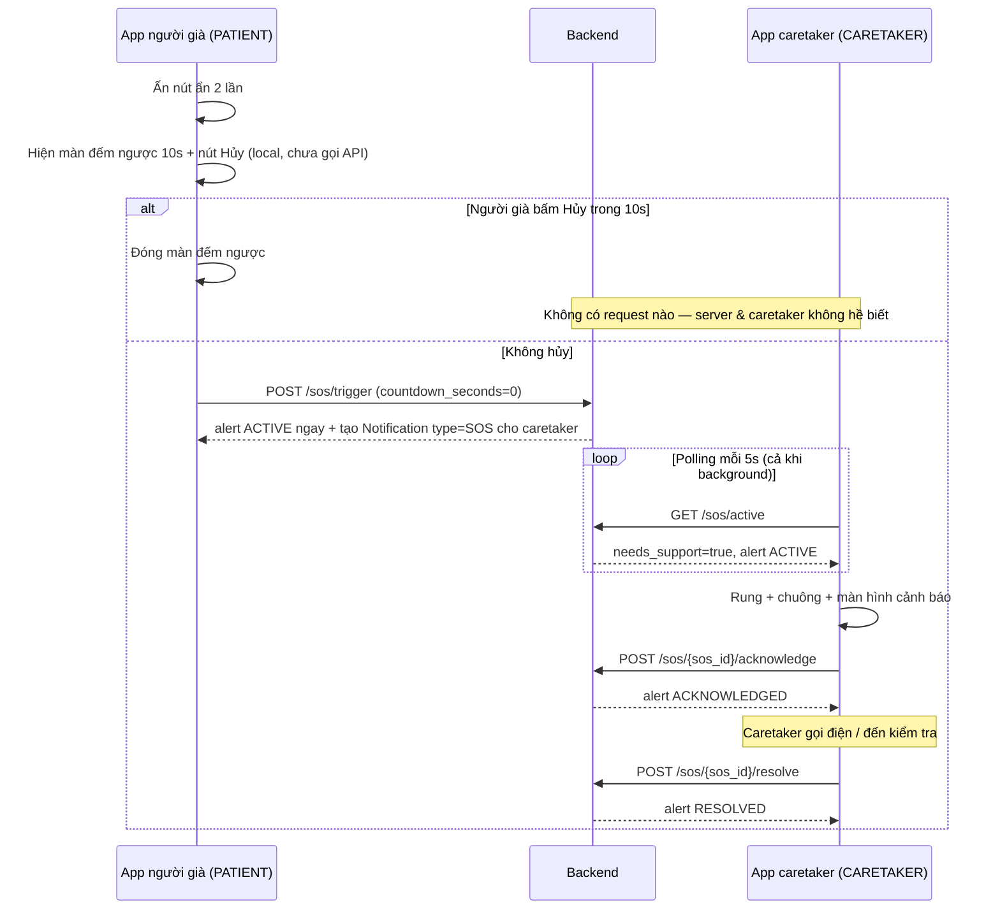
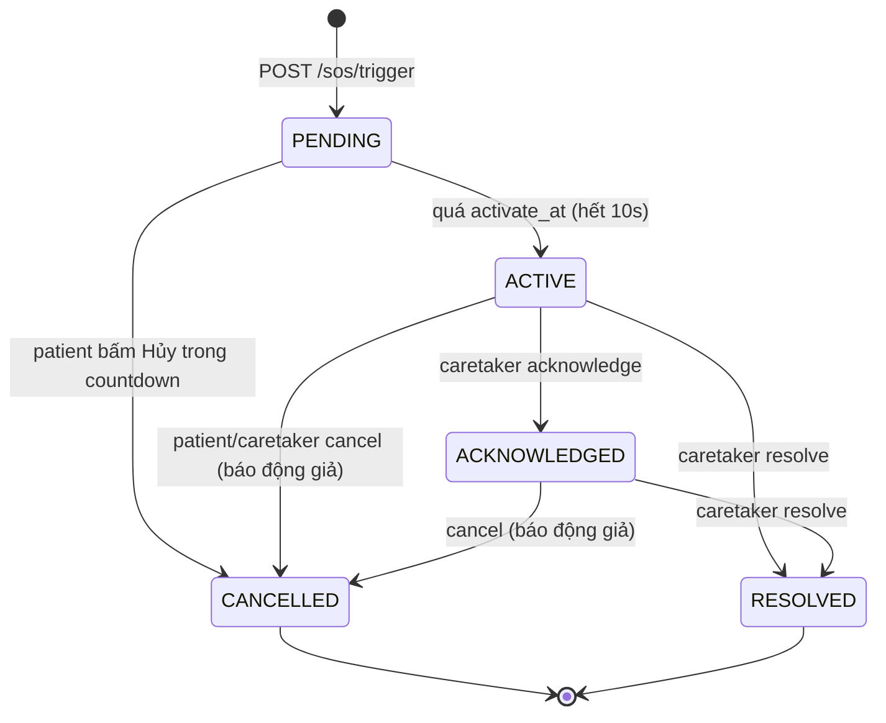

# SOS Alert API — Phát hiện bất thường & Gọi hỗ trợ khẩn cấp

Base router: `/sos` (đầy đủ: `{API_PREFIX}/sos`, ví dụ `/api/sos`)

Tài liệu này mô tả **toàn bộ flow SOS** cho cả **Frontend (app người già + app caretaker)** và **Backend**.

---

## 1. Tổng quan flow

Flow demo hiện tại ở phía app người già (patient):

1. Người già **ấn nút ẩn 2 lần** tại nút thông báo (chuông) ở màn home.
2. App hiện **màn hình đếm ngược 10 giây** (không phát âm thanh) — kèm nút **Hủy**.
3. Nếu **không hủy trong 10 giây** → app gọi `POST /sos/trigger` với `countdown_seconds = 0` → alert `ACTIVE` ngay → caretaker được thông báo.
4. App caretaker **polling** backend mỗi 5 giây (kể cả khi app ở background, chừng nào process còn sống) để biết người già có đang cần hỗ trợ hay không.

### Nguyên tắc thiết kế: countdown chạy trên client

App người già **không** gọi API khi bắt đầu đếm ngược. Đếm ngược 10 giây chạy hoàn toàn trên máy:

- Nếu người già bấm **Hủy** trong 10s → không có request nào được gửi, server không hề biết có alert.
- Nếu **không hủy** → hết 10s app gọi `POST /sos/trigger` với `countdown_seconds = 0` → server tạo alert và kích hoạt `ACTIVE` ngay lập tức + tạo bản ghi Notification (`type = "SOS"`) cho caretaker.
- Nếu request trigger fail (mất mạng) → app retry mỗi 2 giây tới khi thành công.

**Đánh đổi**: nếu app người già bị kill/sập nguồn *trong* 10 giây đếm ngược thì alert không được gửi (server chưa biết gì). Backend vẫn hỗ trợ countdown server-side (`countdown_seconds > 0`, trạng thái `PENDING`, lazy promotion) nếu sau này muốn quay lại mô hình server-authoritative.

### Sequence diagram



### Vòng đời trạng thái (state machine)



| Trạng thái | Ý nghĩa | Ai thấy |
|---|---|---|
| `PENDING` | Đang đếm ngược, patient còn có thể hủy | Chỉ patient (caretaker **không** thấy) |
| `ACTIVE` | Hết countdown, cần hỗ trợ ngay | Patient + caretaker (`needs_support = true`) |
| `ACKNOWLEDGED` | Caretaker đã thấy cảnh báo, đang xử lý | Patient + caretaker (`needs_support = true`) |
| `RESOLVED` | Caretaker xác nhận đã xử lý xong | Chỉ còn trong history |
| `CANCELLED` | Bị hủy (trong countdown hoặc báo động giả) | Chỉ còn trong history |

Mỗi patient chỉ có **tối đa 1 alert đang mở** (`PENDING` / `ACTIVE` / `ACKNOWLEDGED`) tại một thời điểm. Trigger lặp lại khi đang có alert mở sẽ trả về alert đó (idempotent, `already_exists = true`) — an toàn với demo "ấn nút ẩn 2 lần" hoặc ấn nhiều lần liên tiếp.

---

## 2. Database

Bảng mới `sos_alert` (tự tạo qua `Base.metadata.create_all` khi backend khởi động — không cần chạy migration tay; nếu deploy dùng Alembic thuần thì `alembic revision --autogenerate`):

| Cột | Kiểu | Ghi chú |
|---|---|---|
| `sos_id` | UUID PK | |
| `patient_id` | UUID FK → `users.user_id` | NOT NULL, CASCADE |
| `caretaker_id` | UUID FK → `users.user_id` | NULL nếu patient chưa được gán caretaker, SET NULL |
| `status` | VARCHAR(20) | `PENDING / ACTIVE / ACKNOWLEDGED / RESOLVED / CANCELLED` |
| `trigger_source` | VARCHAR(30) | `HIDDEN_BUTTON / VOICE / FALL_DETECTION / MANUAL` |
| `message` | TEXT | Ghi chú tùy chọn từ client |
| `countdown_seconds` | INT | Mặc định 10 |
| `activate_at` | TIMESTAMP | `created + countdown_seconds` — mốc chuyển sang ACTIVE |
| `activated_at` / `cancelled_at` / `acknowledged_at` / `resolved_at` | TIMESTAMP | Audit trail từng bước |
| `cancelled_by` | VARCHAR(20) | `PATIENT` hoặc `CARETAKER` |
| `created_at` | TIMESTAMP | |

Khi alert chuyển `PENDING → ACTIVE`, backend tạo thêm 1 bản ghi trong bảng `notification` cho caretaker (`type = "SOS"`) — hiển thị được ngay trong danh sách notification hiện có (`GET /notifications`).

### Cơ chế kích hoạt "lazy promotion" (backend)

Không có scheduler chạy mỗi giây. Thay vào đó, **mọi đường đọc/ghi alert** (`trigger`, `get_active`, `cancel`, `acknowledge`, `resolve`, `history`) đều gọi `_promote_if_due()`: nếu alert đang `PENDING` và `now >= activate_at` thì chuyển thành `ACTIVE` + tạo notification ngay tại thời điểm đó. Vì caretaker polling mỗi ~5 giây nên độ trễ kích hoạt thực tế ≤ chu kỳ polling. Toàn bộ so sánh thời gian dùng `datetime.now()` phía app server (không trộn với clock của DB).

---

## 3. API Reference

Tất cả endpoint yêu cầu header `Authorization: Bearer <JWT>`. Response bọc chuẩn dự án:

```json
{ "code": "200", "message": "Thành công", "data": { ... } }
```

Lỗi trả về `{ "code": "<http_code>", "message": "..." }` qua `CustomException`.

### Object `SosAlert` (dùng chung trong các response)

```json
{
  "sos_id": "8f2c...-uuid",
  "patient_id": "uuid",
  "caretaker_id": "uuid | null",
  "status": "PENDING",
  "trigger_source": "HIDDEN_BUTTON",
  "message": null,
  "countdown_seconds": 10,
  "activate_at": "2026-07-28T10:15:40",
  "activated_at": null,
  "cancelled_at": null,
  "cancelled_by": null,
  "acknowledged_at": null,
  "resolved_at": null,
  "created_at": "2026-07-28T10:15:30",
  "remaining_seconds": 7
}
```

`remaining_seconds`: số giây còn lại trước khi alert thành `ACTIVE` (chỉ > 0 khi `PENDING`). **FE nên đếm ngược theo giá trị này** thay vì tự tính từ đồng hồ máy — tránh lệch giờ client/server.

---

### 3.1. `POST /sos/trigger` — Kích hoạt SOS (bắt đầu đếm ngược)

- **Auth**: chỉ `PATIENT`.
- **Gọi khi**: vừa phát hiện bất thường (ấn nút ẩn 2 lần), **trước** khi đếm ngược.
- **Body** (mọi field đều optional):

```json
{
  "trigger_source": "HIDDEN_BUTTON",
  "message": "Kích hoạt từ nút ẩn màn hình chính",
  "countdown_seconds": 10
}
```

| Field | Kiểu | Ràng buộc | Mặc định |
|---|---|---|---|
| `trigger_source` | string | `HIDDEN_BUTTON / VOICE / FALL_DETECTION / MANUAL` | `HIDDEN_BUTTON` |
| `message` | string | ≤ 500 ký tự | `null` |
| `countdown_seconds` | int | 0–60 (`0` = kích hoạt ngay, không có cửa sổ hủy) | `10` |

- **Success (200)**:

```json
{
  "code": "200", "message": "Thành công",
  "data": {
    "alert": { "...SosAlert...", "status": "PENDING", "remaining_seconds": 10 },
    "already_exists": false
  }
}
```

- `already_exists = true`: patient đang có alert mở sẵn → không tạo mới, trả về alert cũ. FE dựa vào cờ này để **không** phát lại âm thanh/đếm ngược từ đầu nếu alert cũ đã `ACTIVE`.
- **Errors**: `403` (không phải PATIENT), `422` (body sai — pydantic validation).
- Patient chưa được gán caretaker vẫn trigger được (`caretaker_id = null`) — alert vẫn ghi nhận, nhưng không ai được notify (backend log warning).

### 3.2. `GET /sos/active` — **Polling endpoint** (câu hỏi "người già có cần hỗ trợ không?")

- **Auth**: `CARETAKER` (xem patient được gán) hoặc `PATIENT` (xem chính mình — dùng để khôi phục trạng thái khi mở lại app).
- **Success (200)**:

```json
{
  "code": "200", "message": "Thành công",
  "data": {
    "needs_support": true,
    "alert": { "...SosAlert...", "status": "ACTIVE" },
    "server_time": "2026-07-28T10:15:45"
  }
}
```

- `needs_support = true` ⇔ có alert `ACTIVE` hoặc `ACKNOWLEDGED`.
- Với **CARETAKER**: alert `PENDING` bị ẩn (trả `alert = null`) — cửa sổ 10s hủy là riêng tư của patient, tránh báo động giả.
- Với **PATIENT**: `PENDING` được trả về kèm `remaining_seconds` → mở lại app giữa chừng vẫn khôi phục được màn hình đếm ngược.
- Không có alert mở: `{ "needs_support": false, "alert": null, "server_time": "..." }`.
- **Errors**: `404` (caretaker chưa được gán patient), `403` (role khác).

Endpoint này **rẻ** (1 query + có thể 1 update khi promote), thiết kế để gọi lặp mỗi 3–5 giây.

### 3.3. `POST /sos/{sos_id}/cancel` — Hủy alert

- **Auth**: `PATIENT` chủ alert, hoặc `CARETAKER` được gán.
- **Dùng khi**: patient bấm nút **Hủy** trong 10s đếm ngược; hoặc hủy báo động giả sau khi đã `ACTIVE`.
- **Success (200)**: `data` = SosAlert với `status = "CANCELLED"`, `cancelled_by = "PATIENT" | "CARETAKER"`.
- **Errors**: `400` (sos_id không phải UUID; alert đã `RESOLVED`/`CANCELLED`), `403` (không phải chủ/caretaker được gán), `404` (không tìm thấy).

### 3.4. `POST /sos/{sos_id}/acknowledge` — Caretaker xác nhận đã thấy

- **Auth**: chỉ `CARETAKER` được gán với patient của alert.
- **Chuyển**: `ACTIVE → ACKNOWLEDGED`. Dùng để FE caretaker ngừng rung/chuông lặp lại, và app patient hiển thị "Người thân đã nhận được cảnh báo".
- **Errors**: `400` (trạng thái hiện tại không phải `ACTIVE`), `403`, `404`.

### 3.5. `POST /sos/{sos_id}/resolve` — Đóng alert sau khi xử lý xong

- **Auth**: chỉ `CARETAKER` được gán.
- **Chuyển**: `ACTIVE | ACKNOWLEDGED → RESOLVED`.
- **Errors**: `400` (trạng thái không hợp lệ), `403`, `404`.

### 3.6. `GET /sos/history?limit=50` — Lịch sử alert

- **Auth**: `PATIENT` (của mình) hoặc `CARETAKER` (của patient được gán).
- **Query**: `limit` 1–200, mặc định 50.
- **Success (200)**: `data` = mảng SosAlert, mới nhất trước.

---

## 4. Hướng dẫn Frontend — App người già (PATIENT)

### 4.1. Luồng chính

```text
Ấn nút ẩn 2 lần
  → Hiện màn hình đếm ngược 10s + nút HỦY to, rõ   (local — chưa gọi API, không phát âm thanh)
      ├─ Bấm HỦY  → đóng màn hình, không có request nào được gửi
      └─ Hết giờ  → POST /sos/trigger (countdown_seconds=0)
                    → hiển thị "Đã thông báo cho người thân"
```

Chi tiết từng bước:

1. **Đếm ngược cục bộ**: hiện màn hình đếm ngược 10 giây ngay khi ấn nút ẩn 2 lần. Không phát âm thanh, không gọi API.
2. **Nút Hủy trong 10s**: chỉ đóng màn hình đếm ngược (không có gì trên server để hủy). App vẫn gọi `GET /sos/active` một lần để chắc chắn không có alert cũ còn mở — nếu có thì cancel.
3. **Hết giờ**: gọi
   ```
   POST /sos/trigger  body: { "trigger_source": "HIDDEN_BUTTON", "countdown_seconds": 0 }
   ```
   Server tạo alert và kích hoạt `ACTIVE` ngay. Lưu `sos_id` từ response vào state, hiển thị "Đã thông báo cho người thân".
4. **Hủy sau khi đã gửi** (báo động giả): gọi `POST /sos/{sos_id}/cancel` — `ACTIVE`/`ACKNOWLEDGED` đều cancel được; chỉ `RESOLVED`/`CANCELLED` bị từ chối (`400`), khi đó cứ đóng màn hình.
5. **Khôi phục trạng thái** (mở lại app): gọi `GET /sos/active` khi vào foreground:
   - `needs_support = true` → hiện màn "Đã thông báo người thân" + trạng thái (`ACKNOWLEDGED` = "Người thân đã nhận được cảnh báo").
   - `alert = null` → không có gì, về bình thường.
6. **Xử lý offline**: nếu `POST /sos/trigger` fail vì mất mạng → **retry mỗi 2s** tới khi thành công (vẫn gửi `countdown_seconds = 0`), đồng thời hiển thị trạng thái "đang gửi lại".

### 4.2. Pseudo-code (Flutter)

```dart
void onHiddenButtonDoubleTap() {
  showCountdownScreen(
    seconds: 10, // local, không gọi API
    onCancel: closeCountdownScreen,
    onTimeout: () async {
      showSosNotifiedScreen();
      // Retry tới khi server nhận được
      await api.post('/sos/trigger', data: {
        'trigger_source': 'HIDDEN_BUTTON',
        'countdown_seconds': 0,
      });
    },
  );
}
```

---

## 5. Hướng dẫn Frontend — App caretaker (CARETAKER)

### 5.1. Chiến lược polling

- Gọi `GET /sos/active` **mỗi 5 giây**, chạy nền liên tục tới khi nhận được SOS — kể cả khi app ở background, chừng nào process còn sống (timer Dart vẫn chạy khi app bị pause trên Android).
- App bị kill: dựa vào bản ghi Notification (`GET /notifications`, `type = "SOS"`) hoặc FCM push (mục 6 — chưa có). Khi mở lại app / quay lại foreground, poll ngay 1 lần.
- Khi request lỗi (mất mạng/5xx): giữ nguyên UI hiện tại, backoff nhẹ (5s → 10s → 20s, tối đa 30s), khôi phục 5s khi thành công.

### 5.2. Xử lý response

```dart
Timer.periodic(Duration(seconds: 5), (_) async {
  final res = await api.get('/sos/active');
  final data = res.data['data'];
  if (data['needs_support'] == true) {
    final alert = data['alert'];
    if (alert['status'] == 'ACTIVE') {
      // Lần đầu thấy: rung + chuông + màn hình cảnh báo toàn màn hình
      showEmergencyScreen(alert);
      await api.post('/sos/${alert['sos_id']}/acknowledge');
    }
    // ACKNOWLEDGED: đang xử lý — hiện banner thường trực, không rung lại
  } else {
    hideEmergencyBannerIfAny();
  }
});
```

### 5.3. UI đề xuất

| Trạng thái thấy được | UI |
|---|---|
| `ACTIVE` (mới) | Màn hình đỏ toàn màn hình: tên patient, thời gian trigger, nút **Gọi điện**, nút **Đã xử lý xong** (`/resolve`), nút **Báo động giả** (`/cancel`) |
| `ACKNOWLEDGED` | Banner thường trực "Đang xử lý SOS của {tên}" + 2 nút Resolve / Cancel |
| `needs_support = false` | Không hiển thị gì |

Sau `resolve`/`cancel`, alert biến mất khỏi `GET /sos/active`; xem lại ở `GET /sos/history`.

---

## 6. Ghi chú Backend & việc tương lai

- **Không cần migration tay**: bảng `sos_alert` được tạo tự động khi khởi động (`Base.metadata.create_all`). Cột mới trên bảng cũ thì mới cần Alembic.
- **Push FCM**: hiện caretaker biết qua polling + bản ghi Notification. Khi hạ tầng FCM thật sẵn sàng (hiện `firebase_helper.py` đang mock), gắn thêm gửi push trong `SosService._promote_if_due()` — đúng chỗ tạo Notification, dùng `users.register_fcm_token` của caretaker.
- **Escalation** (tương lai): thêm job kiểm tra alert `ACTIVE` quá N phút không ai acknowledge → gọi số khẩn cấp/SMS. Scheduler APScheduler (`notification_scheduler`) có sẵn để thêm job.
- **Nhiều caretaker / patient**: hiện `patient_caretaker` là quan hệ 1-1 (lấy caretaker đầu tiên). Nếu mở rộng nhiều caretaker, `_promote_if_due()` cần tạo notification cho tất cả và `_get_owned_alert` cần check danh sách.
- **Đồng hồ**: mọi mốc thời gian SOS dùng `datetime.now()` của app server (naive, giống toàn bộ codebase). FE luôn dùng `remaining_seconds`/`server_time` từ response, không tự so với đồng hồ máy.

---

## 7. Test nhanh bằng curl

```bash
BASE=http://localhost:8000/api          # chỉnh theo API_PREFIX thực tế
PT="Authorization: Bearer <patient_jwt>"
CT="Authorization: Bearer <caretaker_jwt>"

# 1. Patient trigger (countdown 10s)
curl -X POST "$BASE/sos/trigger" -H "$PT" -H "Content-Type: application/json" \
     -d '{"trigger_source":"HIDDEN_BUTTON"}'
# → lấy sos_id, remaining_seconds=10

# 2a. Hủy trong 10s
curl -X POST "$BASE/sos/<sos_id>/cancel" -H "$PT"

# 2b. Hoặc chờ >10s rồi caretaker polling
curl "$BASE/sos/active" -H "$CT"
# → needs_support=true, status=ACTIVE (kèm notification type=SOS trong GET /notifications)

# 3. Caretaker xử lý
curl -X POST "$BASE/sos/<sos_id>/acknowledge" -H "$CT"
curl -X POST "$BASE/sos/<sos_id>/resolve" -H "$CT"

# 4. Lịch sử
curl "$BASE/sos/history?limit=10" -H "$PT"
```

---

## 8. Các file backend liên quan

| File | Vai trò |
|---|---|
| `app/api/api_sos.py` | 6 endpoint REST |
| `app/services/srv_sos.py` | Logic lifecycle, lazy promotion, tạo notification |
| `app/repository/repo_sos.py` | Truy vấn `sos_alert` + resolve caretaker |
| `app/models/model_sos_alert.py` | Bảng `sos_alert` |
| `app/schemas/sche_sos.py` | Request/response schema |
| `app/helpers/enums.py` | `SosStatus`, `SosTriggerSource` |
| `app/api/api_router.py` | Đăng ký prefix `/sos` |
| `app/repository/repo_notification.py` | Thêm `create()` để ghi notification SOS |
